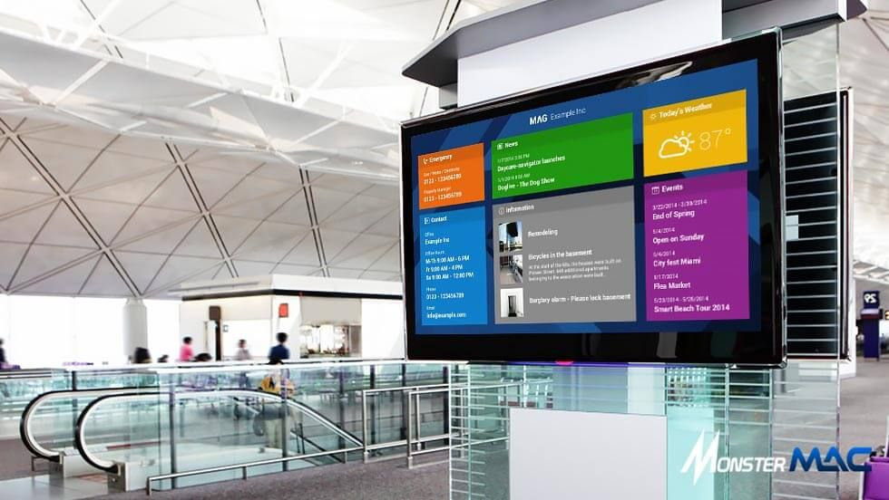

# LUDS

LUDS ( PHP Digital Signage ), una señalización digital simple con software de reproductor a través del navegador:

Esta es la versión comunitaria, software gratuito.

Consulte esta documentación en otros idiomas:
- :us: [versión en inglés](../README.md)
- :brazil: [Versión en portugués disponible](README_pt-BR.md). Esta es la documentación principal. Esto se traduce a los otros idiomas.
- :es: [Versión en español disponible](README_es.md),traducido por Google

otros nombres conocidos
* medios interiores
* medios de televisión
* televisión corporativa
* paneles digitales
* murales digitales

Ver más información sobre:
* Cómo funciona una Señalización Digital - https://www.voxeldigital.com.br/blog/como-funciona-publicacao-digital-signage/
* ¿Qué es un CMS? - https://www.hostinger.com.br/tutorials/o-que-e-cms

# Requisitos
* PHP 8.0.X o superior
* [Adianti Fork Template 7.6.0.X o superior](https://github.com/bjverde/adianti-fork-template/)

# Que hay en cada carpeta
* Documento: solo tiene imágenes y texto auxiliar
* sistema - es el sistema mismo. Con dos partes: La externa que reproductor web y la administrativa interna a la que se accederá en la URL `/admin`

# Montaje de aplicación web

1. Clone el proyecto localmente o en el servidor.
1. Descargue [Fork Adianti Template 7.5.1 o superior](https://github.com/bjverde/adianti-fork-template) y copie el contenido de la plantilla en la carpeta `ludsce\system\admin`. * Las carpetas se pueden combinar. Pero NO REEMPLAZAR ningún *. Tenga en cuenta que puede usar el [Adianti Temaplate 7.5.1] original (https://www.adianti.com.br/framework-download)
1. [Instalar FormDin5 sobre Adianti Template 7.4.0 o superior, como se indica](https://github.com/bjverde/formDin5#instala%C3%A7%C3%A3o)
1. Verifique con git si algún archivo ha cambiado. *Descarta cualquier cambio o archivo nuevo*
1. Tener un servidor PHP 8.0.x o superior, instalado y configurado con PDO SqLite.
1. En el servidor PHP, cree la carpeta `ludsce`
1. Copie el contenido de la carpeta `system` al `ludsce` creado en el elemento anterior.
1. Eso es todo, solo accede al sistema
     1. Parte externa que se mostrará en los televisores, http://SERVIDOR/ludsce/
     1. Parte administrativa: http://SERVIDOR/ludsce/admin

usuario | contraseña | perfil
------ | ------------------ | --------------------
administrador | administrador | es superusuario puede hacer todo en el sistema.
user | user | es superusuario comum que pode apenas postar conteudo.

# Concorrentes 

| Name             | Site                                                     | GitHub                                    | Description                          |
|------------------|----------------------------------------------------------|-------------------------------------------|--------------------------------------|
| Xibo             | https://xibo.org.uk/                                     |                                           | Most Famous software Digital Display |
| Hikvision Europe | https://www.youtube.com/channel/UCRY0VuF6yFucrTqMfZk6Bng |                                           |                                      |
| smil control     | https://smil-control.com/                                | https://github.com/sagiadinos             |                                      |
| CampusVision     | https://johnsonlm.com/CampusVision/                      | https://github.com/JohnsonLM/CampusVision |  

